# Technical Documentation

## **Work Breakdown**

We structured the project so that each of us could have an impact on all the important aspects of the development. Since we often worked togheter in presence commits are not related only to the person that made the commit.

| Member          | Front end| Back end| Documentation|
| --------------- | -------- |---------|--------------|
| Davide Canali   | 25% | 50% | 25% |
| Matteo Cordioli | 50% | 15% | 35% |
| Alessandro Barbiero| 40%  |  45%   | 15% |
| Andrea Cerasani| 35% | 50% | 15% |
 
 

---

## **Technologies and Motivations**

- For the _server side_ development we have used **NodeJS with Express**.
- For the _hosting_ our application we have used **Heroku**. The website is accessible at [https://visitvenice.herokuapp.com](https://visitvenice.herokuapp.com/).
- Since the website is data-base driven, for the _database implementation_ we have used **PostgreeSQL**.
- Since visibility for a turism's website is critical, we decided to use the **Server-Side-Rendering (SSR)** option to render pages on the server side. This choice allows web crawlers to better index the website, resulting in better ranking in search results.

 

---

## **Best Practices Compliance**

While developing the application we followed these particular good practices:

- **Comment** every important aspect of the system(html structure, components, server, database structure) in order to facilitate reading.
- **Accessibility** principles:
  - [x] Brief descriptions of non-text content (such as images) are provided
  - [x] Sequences of information or instructions are independent of any presentation
  - [x] Default foreground and background color combinations provide sufficient contrast
  - [x] Text reflows in small viewports and when users make the text larger
  - [x] Images of text are avoided
  - [x] All functionality that is available by mouse is also available by keyboard
  - [x] Pages have clear titles and are organized using descriptive section headings
  - [x] There is more than one way to find relevant pages within a set of web pages
  - [x] Users are informed about their current location within a set of related pages
  - [x] The keyboard focus is visible, and the focus order follows a meaningful sequence
  - [x] The purpose of a link is evident
  - [x] Buttons, links, and other active components are large enough to make them easier to activate by touch
- Attention to **SEO ranking**. Including meta-tags, alts and so on.
- Reusable and modular Nuxt components

> All the pages of the website have been analyzed with the following tools:
>
> - **WAVE**
> - **Google Lighthouse**

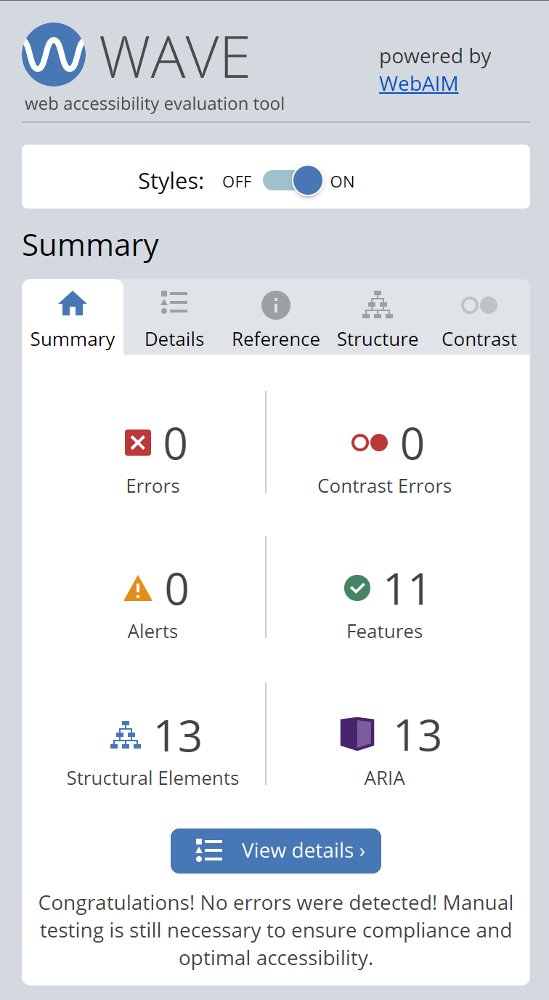
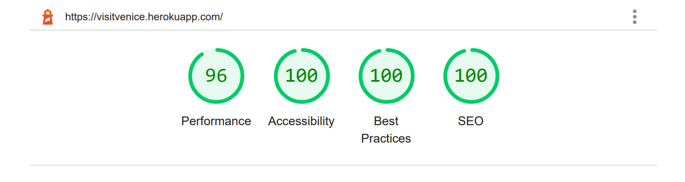

 

---

## **Responsiveness**

We developed the website keeping particular attention on the responsivness so that the website is usable and accessible on all device types.

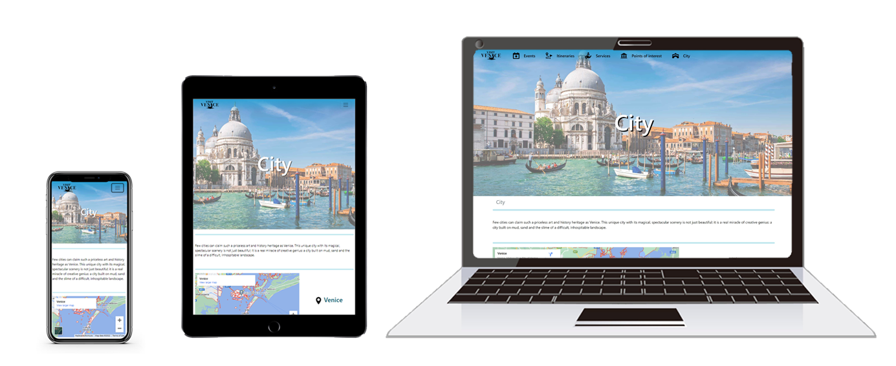

 

---

## **Plugins**
- **[redirect-ssl](https://www.npmjs.com/package/redirect-ssl):**  
  This plugin is used to force the use of _HTTPS_.
  This not only ensure a secure connetion but avoid error that can occour when loading a page over http.

 

---

## **Components**

We developed the components having in mind the expandability of the website so that each page is composed by components that could be useful in future expansion.

- ## **_ImageCarousel_**
     Carusel with a single image per slide full width.

  | Prop         | Type      | Req | Note |
  | ------------ | --------- | --- | ---- |
  | `title`  | `String` | &check; | Title to show at the top. |
  | `elementsToShow`  | `Array` | &check; | List of elements to show in the carousel. It consists of only elements with the path of the image to show. |
  | `numOfCarousel`  | `Number` | &check; | Rappresent the index of carousel in the page, must be different in each carousel to make it work in page. |
  
     

  #### Example

  

   
  
 - ## **_ImageDescriptionCarousel_**
     Carusel with a single image with description and text on the right.

      | Prop         | Type      | Req | Note |
      | ------------ | --------- | --- | ---- |
      | `title`  | `String` | &check; | Title to show at the top of carousel |
      | `elementsToShow`  | `Array` | &check; | List of elements to show in the carousel. It consists of only elements with some props used by CarouselItem component (the path of the image, title, description, an optional date and linkPath for the button).  |
      | `linkName`  | `String` | - | Text to show on the button. |
      | `numOfCarousel`  | `Number` | &check; | Rappresent the index of carousel in the page, must be different in each carousel to make it work in page. |
  
  
     

  #### Example

  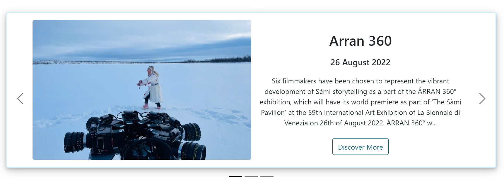

   
  
 - ## **_CarouselItem_**
     Component to put inside a carousel with a single image with description and text on the right and a possible link.

      | Prop         | Type      | Req | Note |
      | ------------ | --------- | --- | ---- |
      | `title`  | `String` | - | Title to show at the top. |
      | `descrImg` | `String` | - | Path to the image to show.      |
      | `date`  | `String` | - | Date to show if the element is an event. |
      | `description`  | `String` | - | Text that will be written under the title. |
      | `linkName`  | `String` | - | The name displayed on the button on the right. |
      | `linkPath`  | `String` | - | Link of the button on the right. |
      | `isLeft`  | `String` | - | Alignment of the text. |

  
  
     

  #### Example

  
   
   
  

- ## **_ShowcaseComponent_**
    Component that shows 4 objects, one big image and 3 smaller, you can change the order of the columns and the background color setting isLeft prop to true or false. The meaning of the component is to give a showcase of something wider, a button on the top right redirect to the general page with all the objects

  | Prop         | Type      | Req | Note |
    | ------------ | --------- | --- | ---- |
  | `title`  | `String` | &check; | Title to show at the top. |
  | `linkName`  | `String` | - | The name displayed on the button on the right. |
  | `linkPath`  | `String` | &check; | Link of the button on the right. |
  | `content`  | `String` | &check; | Array of at least 4 elements with title, image and optional date. |
  | `isLeft`  | `String` | - | Alignment of the big image. |
  
     

  #### Example
  
  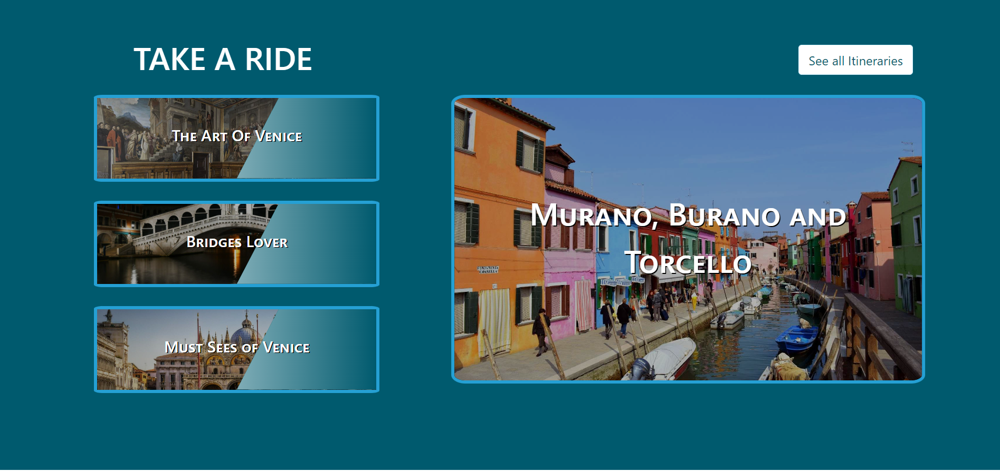

   

- ## **_ClickableImage_**
   Component that shows a clickable image with a title and an optional date, a trapezoid can be added on the right side setting it in the props. Click on the image will bring to the given link.

  | Prop         | Type      | Req | Note |
  | ------------ | --------- | --- | ---- |
  | `name`  | `String` | &check; | Name that will be displayed over the image. |
  | `date`  | `String` | - | Date to show if the element is an event. |
  | `img`   | `String` | &check; | Path of the background image. |
  | `link`  | `String` | &check; | Link to redirect to when the image is clicked. 
  | `trapezoid`  | `Boolean` | - | If true show a trapeziod overlay over the image. |

     

  #### Example

  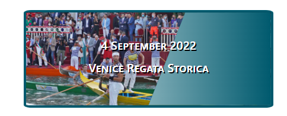
  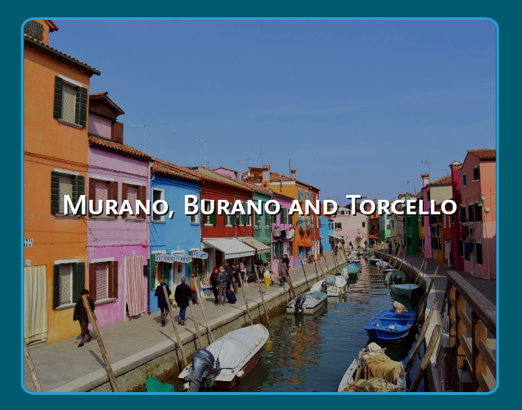
    
   
  
- ## **_HypertextIndex_**
    Component that shows a list of hyperlinks to various parts of the page.

  | Prop         | Type      | Req | Note |
  | ------------ | --------- | --- | ---- |
  | `chapters`  | `Array` | &check; | Contain a series of elements with the attribute title, it will be used as href and displayed. |

     

  #### Example

  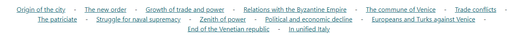

   

- ## **_SimpleContent_**
    Component with title and text that occupies all width of the page.

  | Prop         | Type      | Req | Note |
  | ------------ | --------- | --- | ---- |
  | `title`  | `String` | - | Title of the paragraph. |
  | `description`  | `String` | - | Text that will be written under the title. |
  | `textAlign`  | `String` | - | Alignment of the text. |

     

  #### Example

  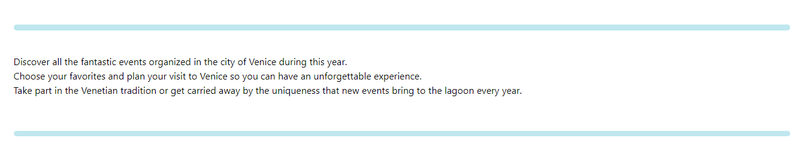

   

- ## **_Chapter_**

  Component that can be used to display a chapter with a title and different paragraphs, with the possibility to add an image. Should be used to format long text.

  | Prop         | Type      | Req | Note |
  | ------------ | --------- | --- | ---- |
  | `title`  | `String` | - | Title of the chapter. |
  | `paragraphs`  | `Array` | &check; | Array of paragraphs to show. |
  | `image`  | `String` | - | Path to the image to show. |

     

  #### Example

  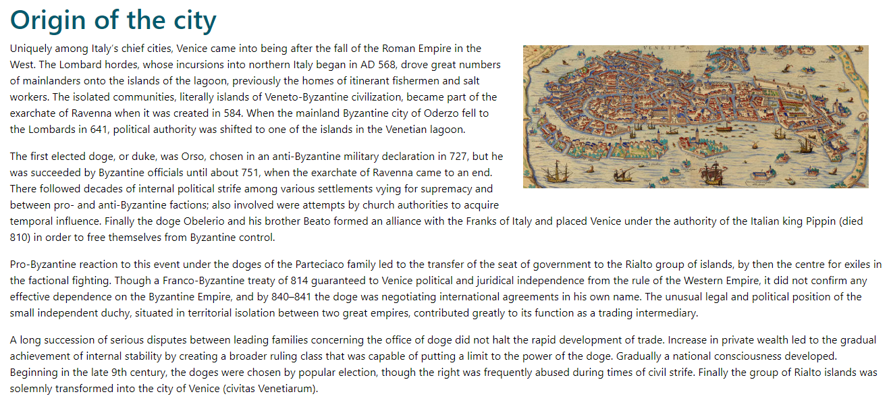

   

- ## **_Mosaic_**
    Component that shows a page of cards created from the items passed with title, image and date.
    
  | Prop         | Type      | Req | Note |
  | ------------ | --------- | --- | ---- |
  | `items`  | `Array` | &check; | List of items to show in a mosaic format. The elements in the array must have the required props of the Item-Mosaic Component |

     

  #### Example

  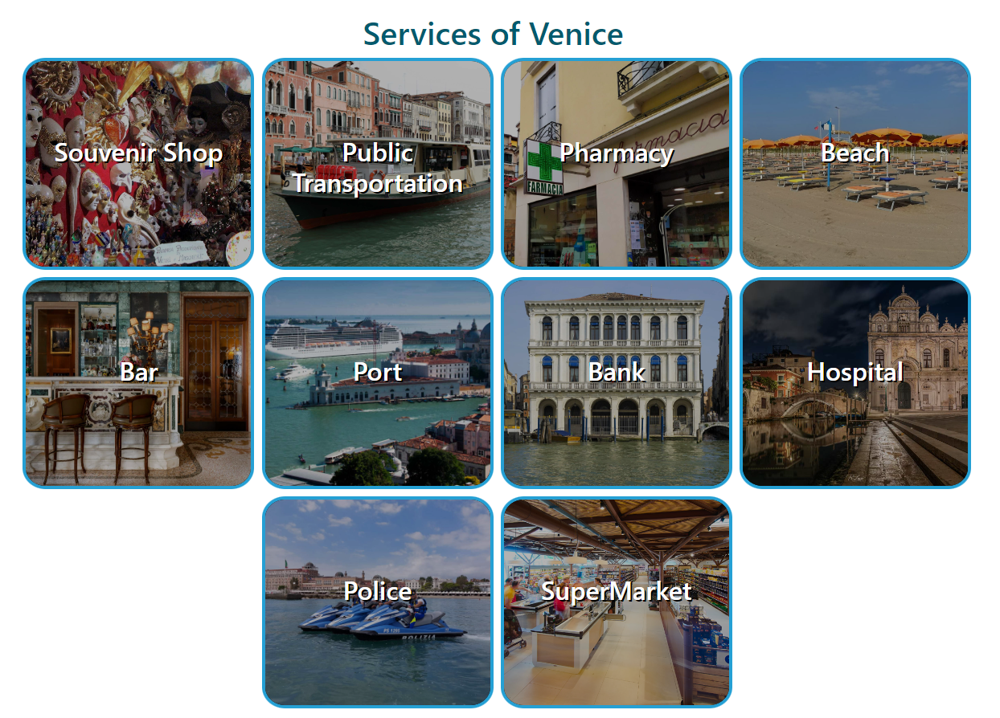
    
   

- ## **_Item-Mosaic_**
  Component that represent a mosaic item, it is a clickable image with title and optional date. It is thought to be displayed in a grid of item-mosaic

  | Prop         | Type      | Req | Note |
  | ------------ | --------- | --- | ---- |
  | `name`  | `String` | &check; | Text to show over the image. |
  | `date`  | `String` | - | Date to show if the element is an event. |
  | `img`  | `String` | &check; | Path of the background image. |
  | `link`  | `String` | &check; | Link to the page of the element. |

     

  #### Example

  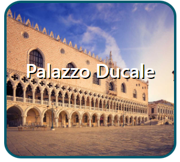
  
   

- ## **_ImageContacts_**

  Component that show the contacts of a business alongside an image
  
  | Prop         | Type      | Req | Note |
  | ------------ | --------- | --- | ---- |
  | `title`  | `String` | &check; | Title to show on top. |
  | `img`  | `String` | - | Path of the image to show. |
  | `openingHour`  | `String` | - | Opening hour of the business. |
  | `closingHour`  | `String` | - | Closing hour of the business. |
  | `phone`  | `String` | - | Number of phone. |
  | `isLeft` | `Boolean` | &check; | Alignment of text respect to the image. |
   

  #### Example

  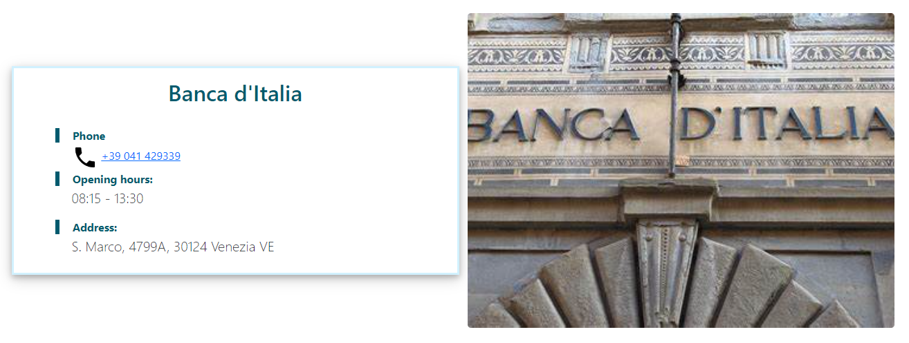

   

- ## **Contacts**

  Component that show a box with contact info and other informations.

  | Prop         | Type      | Req | Note |
  | ------------ | --------- | --- | ---- |
  | `title`  | `String` | - | Title to show on top. |
  | `date`  | `String` | - | Date used to show when an event take place. |
  | `openingHour`  | `String` | - | Opening hour of the business. |
  | `closingHour`  | `String` | - | Closing hour of the business. |
  | `ticket`  | `Number` | - | Price of the ticket. |
  | `landlinePhone`  | `String` | - | Number of the landline phone.  |
  | `mobilePhone`  | `String` | - | Number of the mobile phone. |
  | `email`  | `String` | - | Email address. |
  
   
  
  #### Example
  
  
  
   
- ## **_MapCard_**
  Component that shows a map, based on the props passed it redemension itself to the correct width to have a title and button on the right or be a full screen map. The map can be made from an address or from a weblink. When the image shrinks the text goes down
  
  | Prop         | Type      | Req | Note |
  | ------------ | --------- | --- | ---- |
  | `title` | `String` | - | Title that is shown beside the map.  |
  | `address` | `String` | - | Adress of the place to search on GoogleMaps.|
  | `showButton` | `Boolean` | - | if false hide the button that redirect to the page of the point of interest shown on the map. The link is created from the title, hide the button if you are not showing a point of interest address |
  | `webLink` | `String` | - | Link used for a Google MyMap. |
  | `zoom` | `Number` | - | Used to zoom on the map. |
   
  
  #### Example
  
  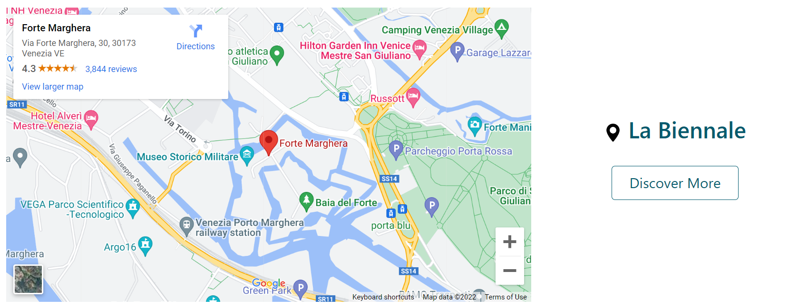
  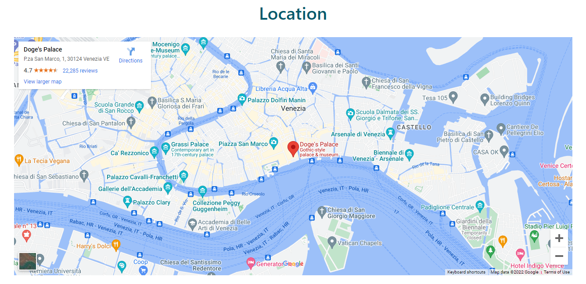
  
   
- ## **_DescriptionCard_**
    Component with an image and a part of text on the left or right that when the img shrinks the text goes down with a possible link added 
    
  | Prop         | Type      | Req | Note |
  | ------------ | --------- | --- | ---- |
  | `title`    | `String` | - | Title of the element to show.   |
  | `descrImg` | `String` | - | Path to the image to show.      |
  | `description` | `String`| - | Description of the element. |
  | `linkName`    | `String` | - | Text to show on the button.   |
  | `linkPath` | `String` | - | Link to the page displayed when clicking on the button      |
  | `isLeft` | `String`| - | Set the image on the left or right. |
  
  
   
  
  #### Example
  
  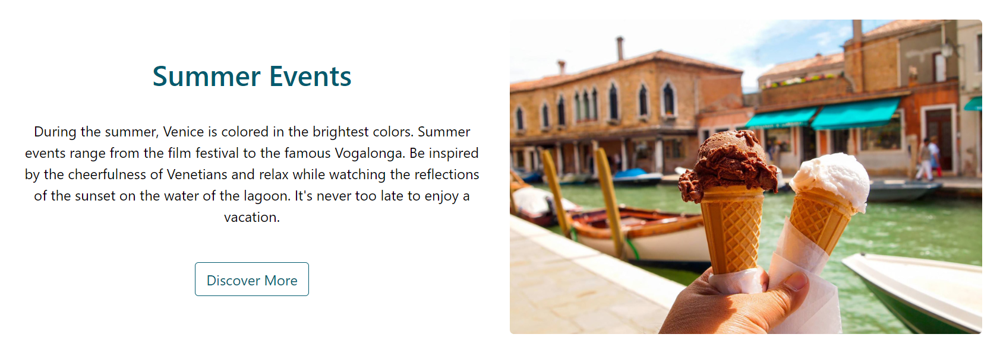
  
   
- ## **_TopImage_**
  Display a full width image with the title of the current page.
  
  | Prop         | Type      | Req | Note |
  | ------------ | --------- | --- | ---- |
  | `bgImg` | `String` | &check; | Path of the image. |
  | `title` | `String`| &check; | Title that will be shown.
  
   
  
  #### Example
  
  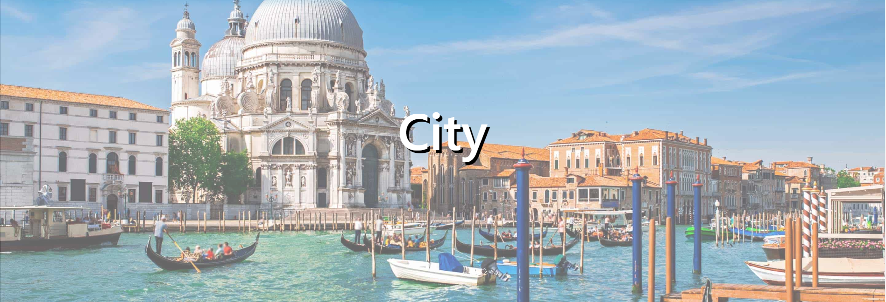
  
   
- ## **_GroupLinks_**
   Links that help the user to navigate between elements of a group. Each page save the link of elements of each group that is in that page so that when the user navigates in one of those elements we can retrive the corrisponding group links.
   
  | Prop         | Type      | Req | Note |
  | ------------ | --------- | --- | ---- |
  | `type` | `String` | &check; | Category used to choose the right type of page to retreive group links for, from those saved by the parent page. (services, events, pois, itineraries, event-type)|
  | `pageName`  | `String` | &check; | Used to select the current element in the group links so that it's possible to get the previous and next elements.|
  
   
  
  #### Example
  
  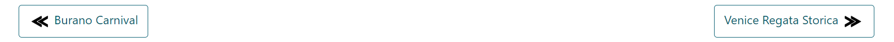
  
   
- ## **Breadcrumbs**
    Dynamic breadcrumbs that follow the path that the user did in the website. Rules implemented:
    - Keep track of each page visited by the user.
    - If the user visit a page that is present in the breadcrumbs truncate all the links after that.
    - If the user clicks on the Landmarks on the navbar the breadcrumbs are restarted.
    - Only show the last 3 visited pages.
    - When a user use the group links don't add another link but change the last one.
     
    
  | Prop         | Type      | Req | Note |
  | ------------ | --------- | --- | ---- |
  | `pageName`     | `String`  | &check; | The name of the current page, this name is the one that will be displayed as last one.|
  | `link` | `String` | &check; | The link of the current page, this will be saved and used when the user will click on the breadcrumbs after changing page.|
  
   
  
  #### Example
  
  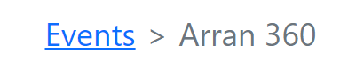
  
   
- ## **_TheFooter_**
  Footer of the website with group icon, contact us and social icons.  
   
    
  #### Example
  
  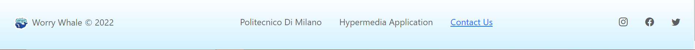
  
   
- ## **_TheHeader_**
  Responsive header with group icon and landmarks.  
   
    
  #### Examples
  
   
